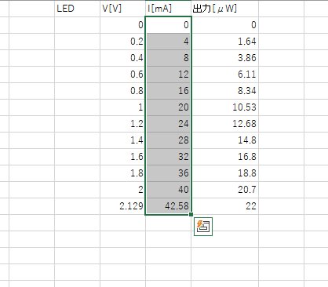
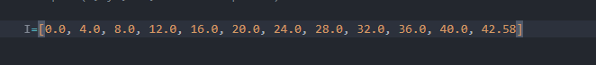

# Report_graph_tool
## What's this?
Excelの列をペーストしたいとき、

こうなるから、
クリップボードをいじって、こうするツール

## requirements
python,pyperclip,matplotlib,numpy  
## excel_to_py 
excelでセルをコピーした状態でこれを走らせると、pythonの配列にクリップボード内データが変換されるから、
そのままpythonコード内で使える

使用ソフト（純正OfficeやGoogleドキュメント、リブレオフィス）によっては出力される配列の最後尾のデータが空白になってエラーになるから、適宜コメントアウトしてある行を追加してエラーを回避してください。

##graph_gen 

